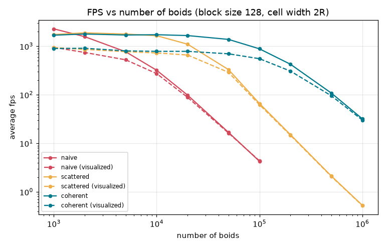
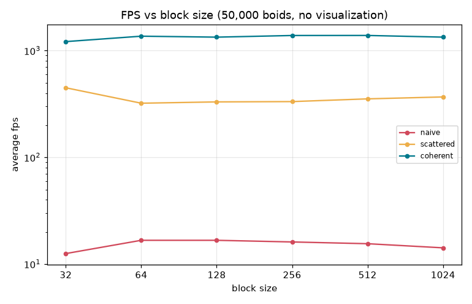
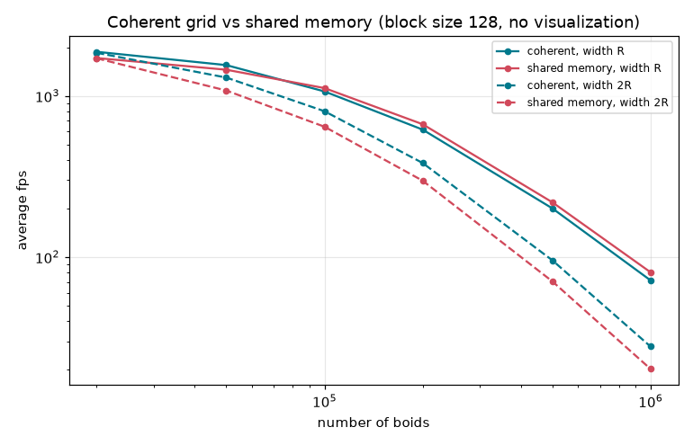

**University of Pennsylvania, CIS 5650: GPU Programming and Architecture,
Project 1 - Flocking**

* Chen Cheng
  * [LinkedIn](https://www.linkedin.com/in/chen-andrew-cheng-34a133229/), [GitHub](https://github.com/ischencheng)
* Tested on: Windows 11, i5-12500H @ 2.50GHz 16GB, NVIDIA GeForce RTX 2050 4GB (personal laptop)

### Screenshots


This is 20,000 boids with the coherent grid and a fixed camera. The boids start
at random positions in a cube and slowly gather into small flocks. The color
shows the velocity of each boid. The gif shows one frame every 15 simulation steps.


### What I did

* **Naive:** every boid checks every other boid for the three rules (cohesion,
  separation, alignment), so one step is O(N²).
* **Uniform grid (scattered):** I label each boid with its grid cell, sort the
  boid indices by cell with `thrust::sort_by_key`, and then find where each cell
  starts and ends in the sorted array. Then a boid only checks the boids in the
  cells around it.
* **Coherent grid:** same as the uniform grid, but after sorting I also reorder
  the positions and velocities. Now the boids in one cell sit next to each other
  in memory and there is no extra `particleArrayIndices` lookup. The boids just
  stay in the sorted order for the next step.
* **8 or 27 cells:** the cell width can be 2R (check 8 cells) or R (check 27
  cells), where R = 5 is the largest rule distance.
* **Extra credit, grid-looping:** instead of hard coding 8 or 27 cells, each
  boid computes the min and max cell index on each axis from `pos - R` and
  `pos + R` and loops over that range. A cell whose closest point is farther
  than R is skipped, because none of its boids can be a neighbor. This works for
  any cell width, not only R and 2R.
* **Extra credit, shared memory:** a fourth version (`-mode shared`) on top of
  the coherent grid. The boids of one block load their neighbor cells into
  shared memory together and then read their neighbors from there. See the last
  section.

I also added some command line options, so I don't have to recompile for every test:

```
cis5650_boids.exe -n 20000 -mode coherent -block 128 -cell 2 -novis -time 5
```

`-mode` is `naive`, `scattered`, `coherent` or `shared`, `-cell` is the cell width in
units of R and `-novis` turns off drawing. With `-time 5` the program runs for 5
seconds after 1 second of warm up, prints the average fps and exits. The window
title also shows the average fps. I turned off v-sync in the code with
`glfwSwapInterval(0)`. I did not change `CMakeLists.txt`.

### Performance Analysis

How I measured: Release build, v-sync off, and `-time 5`, so each number is the
average fps over 5 seconds after 1 second of warm up. I ran every setting 3
times and took the median. Unless said otherwise the block size is 128 and the
cell width is 2R. The scene is always the same 200×200×200 box, so more boids
also means more boids in each cell.

#### Number of boids



| boids | naive | scattered | coherent | naive (vis) | scattered (vis) | coherent (vis) |
| --- | --- | --- | --- | --- | --- | --- |
| 1,000 | 2279 | 1742 | 1688 | 947 | 941 | 896 |
| 5,000 | 769 | 1779 | 1702 | 525 | 773 | 803 |
| 20,000 | 98 | 1102 | 1658 | 89 | 659 | 784 |
| 100,000 | 4.3 | 66 | 884 | 4.4 | 62 | 554 |
| 500,000 | - | 2.1 | 108 | - | 2.1 | 95 |
| 1,000,000 | - | 0.53 | 32 | - | 0.52 | 30 |

For small flocks all three versions run at about 1700-2300 fps without drawing.
A frame is so short here that the fixed cost of each frame (kernel launches,
mapping the OpenGL buffers, polling window events) is most of the time. Naive
even wins at 1,000 boids, because it only launches two kernels while the grids
also run the thrust sort and four more kernels. After that naive drops fast:
5× more boids (20,000 → 100,000) makes it about 23× slower, which is close to
N². The coherent grid is the clear winner for large flocks. At 100,000 boids it
runs at 884 fps, vs 66 for scattered and 4 for naive, and it still gets 32 fps
with 1,000,000 boids.

Drawing caps every version at about 900 fps for small flocks. With many
boids the simulation is the slow part, so the lines with and without drawing
come together.

#### Block size



#### 8 vs 27 cells

| boids | scattered, 2R (8 cells) | scattered, R (27 cells) | coherent, 2R (8 cells) | coherent, R (27 cells) |
| --- | --- | --- | --- | --- |
| 20,000 | 1066 | 1330 | 1671 | 1688 |
| 100,000 | 66 | 103 | 883 | 1145 |
| 500,000 | 2.1 | 5.1 | 108 | 227 |

### Answers to Questions

* **For each implementation, how does changing the number of boids affect performance? Why do you think this is?**

  All of them get slower with more boids. Naive is O(N²) because every boid
  looks at every other boid, and the numbers follow that from about 5,000 boids
  on. The grids only look at the boids in the nearby cells, so they are much
  faster. But they are not O(N) here: the box doesn't grow, so with 10× more
  boids every cell also has about 10× more boids to check. That is why the grid
  lines also bend down for large flocks. The scattered grid drops even faster
  than that, which I think is because its random reads stop fitting in the cache
  (see the coherent question below).

* **For each implementation, how does changing the block count and block size affect performance? Why do you think this is?**

  The block count is just N / block size here, so the two change together. For
  naive and coherent, the block size doesn't matter much from 64 to 1024 (within
  about 15%), and 32 is the slowest. I think this is because one SM can only
  hold 16 blocks at a time on this GPU. With 32 threads per block that is only
  16 warps per SM, which is not enough to hide the memory latency.

  The scattered grid is the odd one: it is fastest with 32 (449 fps vs about 330).
  My guess is that with fewer warps on each SM, fewer random reads compete for the
  small L1 cache, so more of them hit. Its reads are so scattered that cache hits
  matter more than having many warps.

* **For the coherent uniform grid: did you experience any performance improvements with the more coherent uniform grid? Was this the outcome you expected? Why or why not?**

  Yes, a lot: it is 13× faster than scattered at 100,000 boids and about 60×
  faster at 1,000,000. I expected it to be faster, but not by this much. I think
  two things help. First, the boids of one cell are next to each other in memory,
  so reading a cell reads whole cache lines instead of one 12-byte `vec3` out of
  each line. Second, and I think this is the bigger one, the thread index is now
  the sorted index, so the 32 threads of a warp are boids in the same or nearby
  cells. They read almost the same neighbor cells at the same time, so they share
  the data in the cache. In the scattered version the threads of a warp are boids
  from random places in the box, so every thread reads different memory. The
  extra reshuffle kernel is cheap compared to this.

* **Did changing cell width and checking 27 vs 8 neighboring cells affect performance? Why or why not?**

  Yes, 27 cells with width R was faster, up to 2.4× at 500,000 boids. What
  matters is the volume we search, not the number of cells. 8 cells of width 2R
  make a (4R)³ = 64R³ box, but 27 cells of width R make only a (3R)³ = 27R³ box.
  So with 27 cells each boid checks about 2.4× fewer boids, and checking boids is
  most of the work when the cells are full. For small flocks the two are about
  the same (1671 vs 1688 fps for coherent at 20,000). Then there are few boids to
  check anyway, and the smaller cells mean more cells to visit and a bigger grid
  (42³ instead of 22³ cells) to reset every step.

### Extra Credit: Grid-Looping

To test the skip of far cells, I compared the final version with the same code
without the skip (the commit before it).

| version | cell width | boids | without skip | with skip |
| --- | --- | --- | --- | --- |
| scattered | 2R | 100,000 | 58 | 66 |
| scattered | R | 100,000 | 83 | 103 |
| scattered | R | 500,000 | 3.8 | 5.1 |
| coherent | R | 100,000 | 1168 | 1145 |
| coherent | R | 500,000 | 235 | 227 |

Skipping the far cells makes the scattered grid 14-32% faster, because every
boid it skips would have been an expensive random read. For the coherent grid it
doesn't really help (within about 3%): those boids sit right next to boids we
read anyway, so skipping them saves little, and the test itself costs a bit.

Because the loop range comes from the radius, any cell width works. This is the
coherent grid with 100,000 boids:

| cell width | 0.5R | R | 1.5R | 2R | 3R |
| --- | --- | --- | --- | --- | --- |
| without skip | 960 | 1160 | 772 | 862 | 520 |
| with skip | 846 | 1119 | 809 | 866 | 525 |

R is the best width. With 0.5R a boid visits up to 5×5×5 = 125 small cells, and
there the skip test even makes it slower. With 3R the searched box is big again.
1.5R is a bit slower than 2R. I think this is because with 1.5R some boids loop
over 2 cells on an axis and some over 3, so the threads of a warp diverge.

### Extra Credit: Shared Memory

The boids of one block are next to each other in the sorted order, so they are
also close in space and need almost the same neighbor cells. The shared version
goes over these cells one row (along x) at a time. Since the boids are sorted by
cell, a row of cells is one range of boids. For that, empty cells also need a
start and end, which I get with `thrust::lower_bound` and `thrust::upper_bound`
on the sorted cell indices. For each row, the block finds the part that any of
its threads needs (with `atomicMin`/`atomicMax` in shared memory) and loads it
into shared memory, `blockSize` boids at a time. Then every thread checks its
own neighbors in that tile. I store each boid as a `float4` in shared memory, so
a neighbor is one 16-byte read instead of three 4-byte reads.



| boids | coherent, R | shared, R | coherent, 2R | shared, 2R |
| --- | --- | --- | --- | --- |
| 20,000 | 1879 | 1719 | 1853 | 1713 |
| 100,000 | 1067 | 1119 | 804 | 644 |
| 500,000 | 201 | 219 | 96 | 71 |
| 1,000,000 | 72 | 81 | 28 | 20 |

With cell width R, shared memory is faster from about 100,000 boids on, and 12%
faster at 1,000,000 boids (13% with block size 256: 81.8 vs 72.3 fps). That makes
it the fastest version for large flocks. With cell width 2R it is 20-28% slower
for 100,000 boids and more.

The difference comes from which cells the boids need. With width R every boid
checks the 3×3×3 cells around its own cell, so all boids in a cell need exactly
the same rows and the block works on them together. With width 2R every boid
picks the 2 cells on its side on each axis, so boids in the same block need
different rows. The block still has to go through every row that any of them
needs, and the threads that don't need a row just wait at `__syncthreads()`.
For small flocks shared memory is slower too, because the cells are almost
empty and the extra syncs and atomics cost more than they save.

I expected a bigger gain. I think the coherent version already gets most of its
reads from the L1 cache, and on this GPU the L1 cache and shared memory are the
same hardware, so shared memory mostly saves some load instructions.
