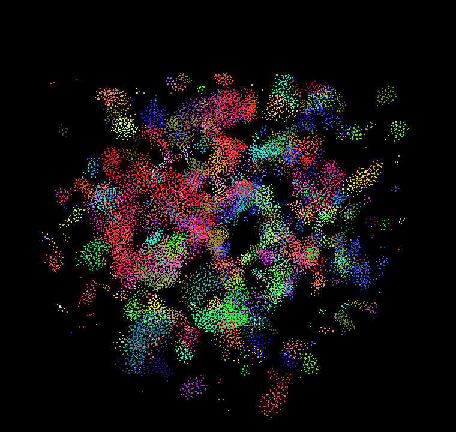

**University of Pennsylvania, CIS 5650: GPU Programming and Architecture,
Project 1 - Flocking**

* Chen Cheng
  * [LinkedIn](https://www.linkedin.com/in/chen-andrew-cheng-34a133229/), [GitHub](https://github.com/ischencheng)
* Tested on: Windows 11, i5-12500H @ 2.50GHz 16GB, NVIDIA GeForce RTX 2050 4GB (personal laptop)

### Screenshots


This is 20,000 boids with the coherent grid and a fixed camera. The boids start
at random positions in a cube and slowly gather into small flocks. The color
shows the velocity of each boid. The gif shows one frame every 15 simulation steps.



### What I did

* **Naive:** every boid checks every other boid for the three rules (cohesion,
  separation, alignment), so one step is O(N²).
* **Uniform grid (scattered):** I label each boid with its grid cell, sort the
  boid indices by cell with `thrust::sort_by_key`, and then find where each cell
  starts and ends in the sorted array. Then a boid only checks the boids in the
  cells around it.
* **Coherent grid:** same as the uniform grid, but after sorting I also reorder
  the positions and velocities. Now the boids in one cell sit next to each other
  in memory and there is no extra `particleArrayIndices` lookup. The boids just
  stay in the sorted order for the next step.
* **8 or 27 cells:** the cell width can be 2R (check 8 cells) or R (check 27
  cells), where R = 5 is the largest rule distance.
* **Extra credit, grid-looping:** instead of hard coding 8 or 27 cells, each
  boid computes the min and max cell index on each axis from `pos - R` and
  `pos + R` and loops over that range. A cell whose closest point is farther
  than R is skipped, because none of its boids can be a neighbor. This works for
  any cell width, not only R and 2R.

I also added some command line options, so I don't have to recompile for every test:

```
cis5650_boids.exe -n 20000 -mode coherent -block 128 -cell 2 -novis -time 5
```

`-mode` is `naive`, `scattered` or `coherent`, `-cell` is the cell width in
units of R and `-novis` turns off drawing. With `-time 5` the program runs for 5
seconds after 1 second of warm up, prints the average fps and exits. The window
title also shows the average fps. I turned off v-sync in the code with
`glfwSwapInterval(0)`. I did not change `CMakeLists.txt`.
